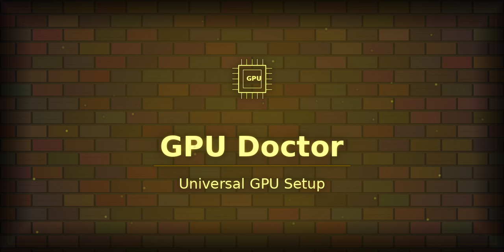

<p align="center"></p>

# gpu-doctor

**Universal GPU setup and diagnostics for PyTorch and JAX.**

One tool. Every backend. Every OS. Zero required dependencies.

```bash
pip install gpu-doctor
python -m gpu_doctor --check      # see exactly what's installed and detected
python -m gpu_doctor --install    # install the right torch for your machine
```

---

## Why this exists

Setting up GPU acceleration for PyTorch and JAX is a maze of platform-specific steps:

- **Windows AMD** — DirectML requires Python ≤ 3.11 and installs in a specific order
- **Linux AMD** — ROCm requires `HSA_OVERRIDE_GFX_VERSION=10.3.0` for older cards (RX 5700 XT, RX 5700, RX 5600 XT) that aren't in ROCm's default allow-list
- **NVIDIA** — standard CUDA, but still requires matching wheel URLs
- **macOS** — MPS just works, but only Apple Silicon

`gpu-doctor` handles all of it. It detects your hardware, applies workarounds automatically, and gives you back one `device` object that works everywhere.

> **Note for PyTorch users:** PyTorch's own `get_best_device()` ([Issue #149719](https://github.com/pytorch/pytorch/issues/149719)) is still an open proposal. `gpu-doctor` ships it today, plus AMD-specific fixes PyTorch doesn't cover.

---

## Platforms

| Platform | Backend | Python | Notes |
|----------|---------|--------|-------|
| **Windows** | DirectML | 3.11 only | AMD / Intel / NVIDIA via `torch-directml` |
| **Linux / WSL2** | ROCm | Any | AMD GPU. gfx1010 override auto-applied. |
| **Linux / Windows** | CUDA | Any | NVIDIA GPU. Standard torch install. |
| **macOS** | MPS | Any | Apple Silicon (M1/M2/M3). |
| **Any** | CPU | 3.8+ | Always works. Zero GPU needed. |

---

## Quick Start

### Step 1 — Check what you have

```bash
python -m gpu_doctor --check
```

Output:
```
==================================================================
  gpu-doctor — Environment Report
==================================================================
  gpu-doctor : v1.0.0
  Python     : 3.11.9
  OS         : Windows  AMD64

  torch      : 2.4.1+cpu
  DirectML   : 0.2.5  (AMD Radeon RX 5700 XT)
  JAX        : not installed

  Best device: directml  ← use this
==================================================================
```

### Step 2 — Install the right torch

```bash
python -m gpu_doctor --install
```

This detects your hardware and runs the correct `pip install` command automatically.

### Step 3 — Use in your code

```python
from gpu_doctor import get_best_device, get_torch_device, get_dtype

# Call BEFORE importing torch — sets env vars (HSA_OVERRIDE, etc.) first
device_type = get_best_device()   # 'directml' | 'rocm' | 'cuda' | 'mps' | 'cpu'
device      = get_torch_device()  # torch.device or DML device — ready for .to()
dtype       = get_dtype()         # torch.float16 or float32 (safe for your backend)

model = MyModel().to(device).to(dtype)
```

---

## Manual Install (Platform-Specific)

### Windows — DirectML (AMD / Intel / NVIDIA GPU)

> **Requires Python 3.11.** torch-directml is compiled against the 3.11 ABI. It will not work on 3.12+.

```bat
:: Create a 3.11 venv
py -3.11 -m venv .venv311
.venv311\Scripts\activate
pip install gpu-doctor

:: Install torch (let DirectML pull torch 2.4.1 — do NOT pre-install torch)
python -m gpu_doctor --install

:: Verify
python -m gpu_doctor --check
```

### Linux / WSL2 — AMD GPU (ROCm)

```bash
pip install gpu-doctor
python -m gpu_doctor --install    # auto-detects ROCm, sets HSA_OVERRIDE if needed

# For RX 5700 XT (gfx1010) — if not auto-set:
export HSA_OVERRIDE_GFX_VERSION=10.3.0   # add to ~/.bashrc

python -m gpu_doctor --check
```

**Or use the Python API to set env vars before importing torch:**
```python
from gpu_doctor import get_best_device     # this sets HSA_OVERRIDE_GFX_VERSION
import torch                               # now sees gfx1010 correctly
```

### Linux / WSL2 — NVIDIA GPU (CUDA)

```bash
pip install gpu-doctor
python -m gpu_doctor --install
python -m gpu_doctor --check
```

### macOS — Apple Silicon (MPS)

```bash
pip install gpu-doctor
python -m gpu_doctor --install
python -m gpu_doctor --check
```

---

## JAX Support

```python
from gpu_doctor import configure_jax_amd, get_jax_backend

# MUST call before import jax
configure_jax_amd()    # sets XLA_FLAGS, MIOPEN_USER_DB_PATH, HSA_OVERRIDE, etc.

import jax
print(get_jax_backend())   # 'gpu' or 'cpu'
```

Install JAX:
```bash
python -m gpu_doctor --install-jax   # auto-detects ROCm / CUDA / CPU
```

---

## AMD RX 5700 XT (gfx1010) — Special Notes

The RX 5700 XT uses the **gfx1010** architecture (Navi 10), which is not in ROCm's default hardware allow-list. Without an override, PyTorch silently falls back to CPU with no error message.

`gpu-doctor` detects this automatically and sets `HSA_OVERRIDE_GFX_VERSION=10.3.0` before torch imports. You don't have to know this exists.

```python
from gpu_doctor import get_best_device   # sets HSA_OVERRIDE_GFX_VERSION=10.3.0
import torch
print(torch.cuda.is_available())   # True — RX 5700 XT now visible
```

**Affected GPUs (auto-handled):**

| GPU | Architecture | Override |
|-----|-------------|---------|
| RX 5700 XT, RX 5700 | gfx1010 | 10.3.0 |
| RX 5600 XT, RX 5500 XT | gfx1010/1011/1012 | 10.3.0 |
| Radeon VII | gfx906 | 9.0.6 |
| RX Vega 56/64 | gfx900 | 9.0.0 |
| RX 6000+ (gfx1030+) | RDNA2/3 | None needed |

---

## CLI Reference

```
python -m gpu_doctor [options]

  (no args)       Quick summary — best device and torch version
  --check         Full environment report (Python, torch, JAX, GPU tools)
  --install       Install correct torch for this machine
  --install-jax   Install correct JAX for this machine
  --json          Machine-readable JSON output (for scripts/CI)
```

```bash
# Use JSON output in scripts
DEVICE=$(python -m gpu_doctor --json | python -c "import json,sys; print(json.load(sys.stdin)['best_device'])")
echo "Training on: $DEVICE"
```

---

## Comparison

| Feature | gpu-doctor | devicetorch | torchruntime | GPUtil | pyamdgpuinfo |
|---------|-----------|-------------|--------------|--------|--------------|
| DirectML (Windows AMD) | ✅ | ❌ | ❌ | ❌ | ❌ |
| ROCm (Linux AMD) | ✅ | ❌ | Partial | ❌ | ❌ |
| CUDA (NVIDIA) | ✅ | ✅ | ✅ | ✅ | ❌ |
| MPS (Apple Silicon) | ✅ | ✅ | ❌ | ❌ | ❌ |
| CPU fallback | ✅ | ✅ | ✅ | ❌ | ❌ |
| HSA_OVERRIDE auto-set | ✅ | ❌ | ❌ | ❌ | ❌ |
| JAX support | ✅ | ❌ | ❌ | ❌ | ❌ |
| --check diagnostic mode | ✅ | ❌ | ❌ | ❌ | ❌ |
| JSON output | ✅ | ❌ | ❌ | ❌ | ❌ |
| Zero required deps | ✅ | ❌ | ❌ | ❌ | ❌ |
| PyPI installable | ✅ | ✅ | ✅ | ✅ | ✅ |

---

## Troubleshooting

**`torch.cuda.is_available()` returns False on AMD (Linux)**
Your GPU likely needs an HSA override. Check:
```bash
python -m gpu_doctor --check   # shows 'rocm_gfx_arch' and 'hsa_override_applied'
```
Then in Python, call `get_best_device()` BEFORE importing torch.

**DirectML not detected on Windows**
- Confirm Python version: `python --version` — must be 3.11 or lower.
- Install: `pip install torch-directml` without pre-installing torch.

**`privateuseone:0` device string**
Normal. This is PyTorch's internal name for DirectML. Use `get_torch_device()` which returns the correct device *object* (not the string) — this is critical for diffusers `.to()` calls.

**JAX sees CPU even with ROCm installed**
Call `configure_jax_amd()` before `import jax`. The env vars must be set before JAX initializes its backend.

More: [torch-amd-setup troubleshooting](https://github.com/ChharithOeun/torch-amd-setup/blob/main/docs/troubleshooting.md)

---

## Related

- [torch-amd-setup](https://github.com/ChharithOeun/torch-amd-setup) — deep AMD GPU detection for PyTorch
- [jax-amd-gpu-setup](https://github.com/ChharithOeun/Chharbot/tree/main/jax-amd-gpu-setup) — JAX on AMD guide
- [directml-benchmark](https://github.com/ChharithOeun/directml-benchmark) — verified float32 GPU benchmarks

---

## Keywords

`AMD GPU PyTorch setup` · `torch.cuda.is_available False AMD fix` · `HSA_OVERRIDE_GFX_VERSION`
`ROCm PyTorch Windows` · `DirectML PyTorch` · `gfx1010 ROCm fix` · `RX 5700 XT PyTorch`
`get_best_device PyTorch` · `cross-platform GPU setup` · `JAX AMD ROCm` · `JAX DirectML`
`privateuseone:0 fix` · `torch-directml Python 3.11` · `Apple Silicon MPS PyTorch`
`WSL2 ROCm setup` · `AMD Radeon deep learning` · `NVIDIA CUDA auto-detect`
`PyTorch device selection` · `GPU auto-detect Python` · `Navi 10 deep learning`

---

## License

MIT
